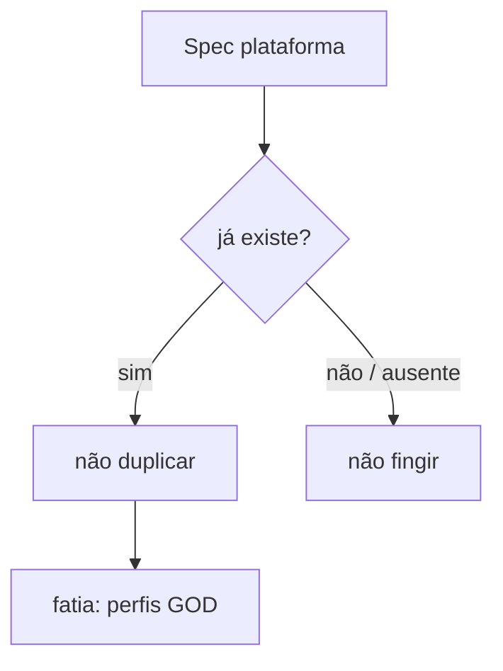

# GOD PLATFORM — mapa sobre o código actual (2026-09-04)

Spec colada: Fast & Easy + Builder. **Não é rebuild.** Zero teatro.

| Spec | Módulo actual | Esta fase |
|---|---|---|
| Orchestrator / Intent / Planner | `runtime.handle` `brain.analyze` `_plan` | **não duplicar** |
| AI Router | `routing.py` | **não duplicar** · models=`auto` |
| Tool Router | `tools.execute` + Governor | allowlist por perfil |
| Memory | `store` + Qdrant hashing | partilhada; isolamento **não** é total |
| Token Intelligence / Cost | `tokens.py` | cost **UNKNOWN** — sem €50 MEASURED |
| Node Manager | `aios` + `queue` + worker local | **só PC**. Laptop/Mobile **ausentes** |
| Security | `governor.py` | perfis não desligam o Governor |
| GOD Manager / Builder | **não havia** | **agora:** `superai/gods.py` + `/api/gods` |
| Desktop Windows / Wizard / SDK / Market / Swarm / Repair GOD | — | **NÃO**. Host Linux, sem .exe, sem G2G |
| Visual workflow | — | **NÃO** (blocos sem função = ficção) |
| GitHub CI/CD auto-update | deploy key; push desta sessão falhou | **não** fingir update |

**O que um GOD é aqui:** JSON em `data/gods/{id}.json` — nome, propósito, personalidade, regras, subset das ferramentas **já catalogadas**. Um `handle`. Trocar de perfil muda prompt + tools. Sem segundo processo.

**Regra:** checkbox = ferramenta real. Sem «Web Research» enquanto SearXNG estiver ausente.
