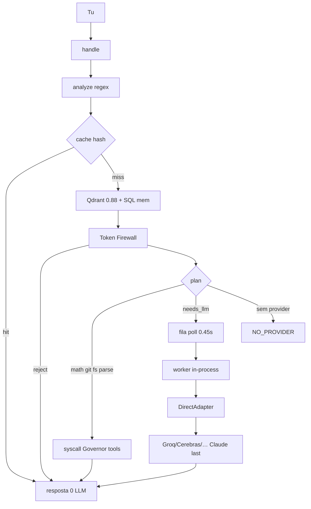

# GOD 2.0 — auditoria (código real, 2026-09-04)

Fonte: `/home/user/super-ai` HEAD local. **Não** é o README. Sem capacidades inventadas.

**Regra:** IMPLEMENTED / PARTIAL / NOT IMPLEMENTED / BROKEN.

Este documento é o **mapa-alvo**. Não renomeia o produto. Não substitui `runtime.handle`.

---

## A — Architecture Audit

| Component | Estado | Problema | Impacto | Ação |
| --- | --- | --- | --- | --- |
| `runtime.handle` | **PARTIAL** | Um pipeline sequencial ~950 linhas: cache→mem→vector→firewall→plan→queue→tools/LLM. É o orquestrador de facto. Não é DAG. | Latência extra em tarefas triviais (vector+mem mesmo em `calcula`). | KEEP. Extrair FAST (sprint 1). Não criar segundo handle. |
| `brain.analyze` | **PARTIAL** | Classificador regex + complexidade por tamanho. Não há FAST/NORMAL/DEEP/AUTONOMOUS. | Intent engine existe; modos 2.0 não. | KEEP + `exec_mode` FAST/NORMAL/DEEP (label). AUTONOMOUS = NOT IMPLEMENTED. |
| `brain` cache hash | **IMPLEMENTED** | SQLite por `god_id`. | Bom para FAST. | KEEP |
| Qdrant hashing 384 | **IMPLEMENTED** | Neural **não**. Post-filter `god_id`. Corre em **todo** cache miss. | Custo CPU em contas/git. | REFACTOR: skip em FAST |
| `tokens` / firewall | **PARTIAL** | Observa + rejeita budget. **Não** escolhe modelo por € (preço UNKNOWN). | Token Governor 2.0 incompleto. | KEEP. Não fingir €. |
| `routing` + `providers` | **PARTIAL** | OmniRoute down → Direct. Ordem local→API→Claude. Sem scores históricos (n=0). | Router 2.0 (latency/cost/history) NOT IMPLEMENTED. | KEEP. Não inventar ranking. |
| `queue` + `compute` | **PARTIAL** | 1 worker in-process, poll 0.45s, inflight=1. `worker.py` remoto existe; chat remoto volta ao control HTTP. | LLM chat paga hop de fila. Paralelo real NOT IMPLEMENTED. | KEEP. FAST não entra na fila (já verdade se `needs_llm=false`). |
| `aios` OS | **IMPLEMENTED** | admit/syscall/kill/ps. Sem preempção. | — | KEEP |
| `governor` | **IMPLEMENTED** | FS, python, git allowlist. Não se auto-altera. | HITL 2.0 (AUTO/CONFIRM/BLOCK matrix) PARTIAL (git push já BLOCK). | KEEP |
| `observer` | **PARTIAL** | Métricas host/fila/cache/budget. **Não** critica planos nem factualidade. | Third Eye 2.0 = NOT IMPLEMENTED. | KEEP nome. Não fingir crítica LLM. |
| `evolution` | **PARTIAL** | Observe + 3 pares paráfrase + ADOPT humano. Não muda núcleo sozinho. | Learn loop limitado. | KEEP |
| `gods` Builder | **PARTIAL** | Perfis + overlay + subset tools. **Não** spawna agentes nem GOD Factory. | Agent Factory / GOD Factory = NOT IMPLEMENTED. | KEEP. Não duplicar core. |
| `tools` | **IMPLEMENTED** | calculator, fs, git, parse, python sandbox, sites `data/projects`. Sem web. | — | KEEP |
| `repair` | **IMPLEMENTED** | CHECKS MEASURED. | — | KEEP |
| Plane | **PARTIAL** | Chave no `.env`. `users/me` 200. Workspace `GODSX` **404**. Sem issues. | Board no produto seria ficção. | Probe MEASURED. Sem adapter de issues até slug real. |
| GitHub | **PARTIAL** | Repo público `rpolicarpo100/GOD` GET 200. Push desta sessão: 403 até o PAT ter Contents write. Local ahead. | F7 | Push quando o token deixar. Sem auto-PR. |
| SearXNG / Ollama / OmniRoute | **NOT IMPLEMENTED** (probed down) | Ausentes neste host. | Não fingir pesquisa/local LLM. | KEEP recusa. |
| Task graph DAG | **NOT IMPLEMENTED** | Não há tabela de deps/PENDING/BLOCKED. | Spec §6. | CREATE só na fase 3, não agora. |
| Parallel research agents | **NOT IMPLEMENTED** | inflight=1. | Spec §7. | Não agora (PC 2 cores cap). |
| Validator separado | **PARTIAL** | `evaluate()` scores heurísticos, não testes da tarefa. | Spec §13. | KEEP scores. Não fingir QA agent. |
| Compute mesh laptop/phone | **NOT IMPLEMENTED** | `pc_node` USER_DECLARED i5-4590/24GB/2TB/GT1030. Este host ≠ esse PC. | Spec §17. | KEEP layout. Sem nós inventados. |
| Desktop / swarm / marketplace | **NOT IMPLEMENTED** | Recusado nesta fase. | — | Não criar. |
| Langfuse / LiteLLM / Redis / Postgres / Kafka | **NOT IMPLEMENTED** | Ausentes. Spec §27: não adicionar por aparência. | — | Não criar. |
| Docs extra (`HUMANAI20*`, `FLUXO.html`, `CORE.md`…) | docs, **não runtime** | Servidor só serve `index.html` + `/preview`. | Ruído. | KEEP ficheiros. Não virar tabs. |
| `cost` API € | **UNKNOWN** | 22€ IVA incluído = subscrição USER_STATED. Não somar. | Spec Token Governor. | KEEP split. |

---

## B — Bottleneck Report (impacto, código)

1. **Vector + SQL memory em todo cache miss** — mesmo `calcula 2+2`. CPU no control. **Sprint 1: skip em FAST.**
2. **Fila + poll 0.45s** para todo `needs_llm`. Chat simples espera worker. FAST determinístico já não enfileira; greetings ainda vão a LLM.
3. **`snapshot()` pesado no SSE** — providers `health_all` cache 5s (ok); payload grande (chat, jobs, token report).
4. **`handle` monolítico** — difícil medir etapas. Sem `latency_ms` por fase.
5. **DirectAdapter tenta até 3 providers** — latência se o 1.º falhar (timeout 12s).
6. **1 worker / inflight 1** — correcto neste sandbox e no cap de 2 cores; **não** é bug. Paralelo 2.0 viria depois, no PC, nunca 4/4.
7. **OmniRoute down** — hop extra de health check porta 20128 (0.25s) por `complete`.
8. **GitHub push 403** — não é latência; é deploy.
9. **Plane workspace 404** — não é latência; integração bloqueada com evidência.
10. **Embeddings HashingVectorizer** — barato vs neural, mas inútil em FAST.

Números de latência end-to-end **não** estão MEASURED nesta auditoria (não havia timer). Sprint 1 adiciona `latency_ms` MEASURED no pipeline.

---

## C — Dependency Map (imports reais)

```
server.FastAPI
  ├─ runtime.handle / snapshot
  │    ├─ brain.analyze / cache / evaluate
  │    ├─ tokens.gate / record
  │    ├─ memory_vec.vectors
  │    ├─ aios.admit / syscall
  │    ├─ queue / compute worker
  │    ├─ routing.complete → providers.ADAPTERS
  │    ├─ tools.execute → governor + gods.allow_tool
  │    ├─ gods overlay
  │    ├─ observer / evolution / benchmark / repair
  │    └─ store (SQLite spine.db)
  ├─ compute.start_local_worker
  └─ aios.boot
resources.host  ≠  resources.declared_node (PC i5-4590)
tokens ↛ preço Groq (UNKNOWN)
governor ↛ self-modify
```

Nenhum módulo crítico importa Claude SDK. Router é a única porta LLM.

---

## D — Current Architecture



PC control + SQLite/Qdrant disco. GPU `required=false`. LLM remoto.

---

## E — Target Architecture (mapa, não código desta fatia)

O spec 2.0. **Não implementado** neste commit para além do FAST skip.

```
HUMAN → UI → INTENT (analyze+exec_mode) → EXECUTIVE (handle)
         ├─ QUICK PATH / FAST
         └─ TASK GRAPH  ← NOT IMPLEMENTED
                PLANNER / AGENT FACTORY / GOD FACTORY ← NOT IMPLEMENTED
                VALIDATOR / THIRD EYE crítica ← NOT IMPLEMENTED
TOKEN GOVERNOR / SECURITY / COMPUTE MESH  ← transversal, parcial
```

Modelos raciocinam. Código orquestra. Mantém-se.

---

## F — Migration Plan

| | |
| --- | --- |
| **KEEP** | handle, analyze, cache, tools, governor, tokens, queue, providers, gods, observer, evolution, repair, SQLite, Qdrant hashing, dashboard viva |
| **REFACTOR** | FAST: não vector/mem em tipos determinísticos; `exec_mode`; `latency_ms`; Plane probe |
| **MERGE** | Nada. Não fundir HumanAI docs no runtime |
| **REMOVE** | Nada neste sprint (docs mortos para o servidor — mais tarde) |
| **CREATE** | `superai/plane.py` probe-only; este `GOD20.md`; `exec_mode` |

Não criar: `ExecutiveBrain` class, 5 agents, swarm, Redis, Postgres, Desktop, marketplace, €50 MEASURED.

---

## G — Implementation Roadmap (ordem do spec, estado)

| Fase | Spec | Estado agora |
| --- | --- | --- |
| 0 | Audit | **FEITO** este ficheiro |
| 1 | Performance + Quick Path | **Sprint 1** (FAST skip + latency_ms) |
| 2 | Executive Brain | PARTIAL = handle. Não substituir. |
| 3 | Task Graph + paralelo | NOT IMPLEMENTED |
| 4 | Model Router 2.0 | PARTIAL DirectAdapter |
| 5 | Agent Factory | NOT IMPLEMENTED |
| 6 | Validator + Third Eye crítica | observer PARTIAL |
| 7 | Token Governor decide € | UNKNOWN preço API |
| 8 | GOD Factory | NOT IMPLEMENTED (Builder ≠ factory) |
| 9 | Compute Mesh | layout USER_DECLARED only |
| 10 | Command Center UI | dashboard viva PARTIAL |

---

## H — First Sprint (só isto a seguir à auditoria)

1. `exec_mode` FAST/NORMAL/DEEP no analyzer. AUTONOMOUS continua NOT IMPLEMENTED.
2. FAST (`math|status|git|files|parse` e complexidade ≤3): **não** Qdrant, **não** memória SQL. Cache hash mantém-se. Tools iguais.
3. `latency_ms` MEASURED no `last_pipeline`.
4. Plane: probe `users/me` + workspace slug. `in_product=false` enquanto 404. **Zero issues inventadas.**
5. Disco PC **2 TB** USER_DECLARED.
6. Push GitHub se o PAT tiver write (MEASURED).
7. Testes. Sem Agent Factory.

Prova de melhoria: `calcula` não toca Qdrant. `latency_ms` aparece. Workspace Plane continua 404 até o slug real.
