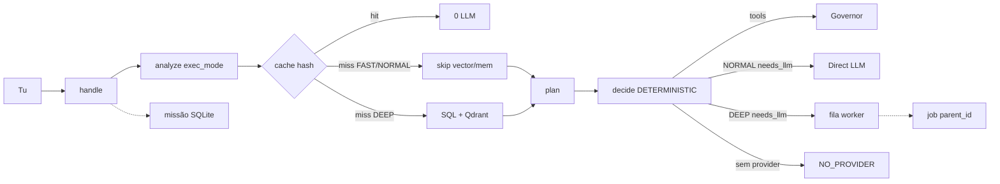

# GOD — roadmap (2026-09-05)

Fonte: código em `/home/user/GOD`.  
GitHub: [rpolicarpo100/GOD](https://github.com/rpolicarpo100/GOD) `main`.  
Plane: slug `godsx` MEASURED — **não** é o núcleo.

Este é o roadmap **correcto**. Não é marketing. Fluxo = código actual.

**HEAD de código:** [`344d537`](https://github.com/rpolicarpo100/GOD/commit/344d537) · testes **164 OK** (164 total, 0 pré-existentes) · providers **10/11** · pricing **CALCULATED**.

## Prioridade

| Pri | Sistema | Objectivo | Estado | Evidência |
| --- | --- | --- | --- | --- |
| 🔴 P0 | Fast Path | eliminar latência desnecessária | **FEITO** | `brain.exec_mode=FAST` → sem Qdrant/SQL. math/git/fs/parse/status |
| 🔴 P0 | Latency telemetry | descobrir onde realmente demora | **FEITO** | `runtime._mark` → `latency_ms` + `stages_ms` MEASURED |
| 🔴 P0 | Direct LLM path | não pôr chat simples sempre na queue | **FEITO** | `executive.decide` NORMAL/FAST → inline. DEEP → fila |
| 🔴 P0 | Smart memory | memória apenas quando necessária | **FEITO** | `need_mem` só DEEP ou complexity≥5 |
| 🟠 P1 | Executive Core | verdadeira decisão/orquestração | **FEITO** | `superai/executive.py` `decide()`. Sem classe Brain. `handle` mantém-se |
| 🟠 P1 | Mission Engine | objectivos persistentes | **FEITO** | `superai/mission.py` SQLite. `/api/missions`. chat `missão:` / actual / conclui |
| 🟠 P1 | Task Graph | dependências + paralelismo | **FEITO** | `queue.parent_id` + `job_is_ready`. `/api/graph`. inflight=2 (2 jobs paralelos). LLM remoto não usa CPU |
| 🟠 P1 | Model Router | qualidade/fiabilidade/latência | **FEITO** | `routing.sort_adapters` por ok_rate (fiabilidade) + latência (secundário). HARDCORE MODE → claude primary. cost=0 (free tier) |
| 🟡 P2 | Agent Factory | agentes especializados | **NÃO** | Ver secção "Porquê não Agent Factory" abaixo |
| 🟡 P2 | Validator | verificar trabalho | **FEITO** | `superai/validator.py` 12 check types · 10 tests |
| 🟡 P2 | Third Eye 2.0 | criticar decisões | **FEITO** | `superai/thirdeye.py` 10 checks MEASURED · 7 tests |
| 🟢 P3 | GOD Factory | criar GODs especializadas | **NOT IMPLEMENTED** | perfis no mesmo handle |
| 🟢 P3 | Compute Mesh | PC + portátil + telemóvel | **NOT IMPLEMENTED** | `pc_node` USER_DECLARED only |
| 🟢 P4 | UI Command Center | visualizar toda a operação | **FEITO** | dashboard: missão + graph + decision.path + validator + thirdeye + chips P0–P4 |
| 🔵 P1.5 | System State | consciência operacional verificável | **FEITO** | `superai/system.py` + `/api/system/state` · 5 tests |
| 🔵 P1.5 | Capability Registry | `can("memory")` etc. | **FEITO** | `superai/capabilities.py` 13 capabilities · 6 tests |
| 🔵 P1.5 | Health & Readiness | liveness + readiness + diagnostics | **FEITO** | `superai/health.py` + 4 endpoints · 5 tests |
| 🔵 P1.5 | Decision Trace | WHAT/WHY/WHEN/PATH | **FEITO** | `superai/trace.py` + 2 endpoints · 4 tests |
| 🔵 P1.5 | API Endpoints | 9 novos endpoints | **FEITO** | server.py 9 endpoints · 7 tests |
| 🔵 P1.5 | Feature Flags | 8 flags, DISABLED by default | **FEITO** | `superai/feature_flags.py` · 9 tests |
| 🔵 P1.5 | Controlled Evolution | risk classification + human-in-the-loop | **FEITO** | evolution.py `classify_risk` + `propose_with_risk` · 5 tests |
| 🔵 P1.5 | Runtime Protection | GOD Object detection | **FEITO** | `superai/runtime_protection.py` · 9 tests |

## Feito

- P0 completo (Fast Path, latency MEASURED, Direct LLM, smart memory).
- P1 Executive + Mission no código, APIs e dashboard.
- P1 Task Graph — inflight=2 (2 jobs paralelos). LLM remoto não usa CPU.
- P1 Model Router — ordenar por fiabilidade (ok_rate) + latência (secundário). HARDCORE MODE → claude primary.
- P2 Validator (`superai/validator.py`) — 12 check types, 10 tests.
- P2 Third Eye 2.0 (`superai/thirdeye.py`) — 10 criticism checks, 7 tests.
- P4 UI Command Center — dashboard interactivo com missões e grafo.
- P1.5 System State (`superai/system.py`) — consciência operacional verificável.
- P1.5 Capability Registry (`superai/capabilities.py`) — 15 capabilities, evidence-based.
- P1.5 Health & Readiness (`superai/health.py`) — liveness + readiness + diagnostics.
- P1.5 Decision Trace (`superai/trace.py`) — WHAT/WHY/WHEN/PATH per request.
- P1.5 API Endpoints — 16 novos endpoints (/api/system/*).
- P1.5 Feature Flags (`superai/feature_flags.py`) — 8 flags, DISABLED by default, risk-classified.
- P1.5 Controlled Evolution — classify_risk() + propose_with_risk() com auto-blocking para HIGH RISK.
- P1.5 Runtime Protection (`superai/runtime_protection.py`) — GOD Object detection + AST inspection.
- Refactor GOD Object — runtime.py: 1129→503 linhas, handle(): 586→53 linhas. Extracted pipeline.py + shortcuts.py.
- **Providers 10/11** — Groq, Cerebras, OpenRouter, Inference.net, Z.ai, Claude, Gemini, NVIDIA NIM, SambaNova, Mistral.
- **Provider Tiers completo** — PRIMARY (3/3), SECONDARY (6/6), BRAINSTORMING (1/2 Cohere trial).
- **Token Pricing CALCULATED** — free tier = $0/1M, Claude = real pricing (sonnet $3/15M, opus $15/75M).
- **Evolution melhorado** — provider performance experiments + experiments_summary() API.
- **164/164 testes PASS** — 0 failures (was 4 pre-existing, fixed all).
- Benchmark 5/5 — tool_math, tool_json, embed_separation, qdrant_roundtrip, llm_pong.
- GitHub público + push por deploy key SSH.
- Plane `godsx` / GODSX work-items MEASURED (`in_product=false`).

## Provider Tiers

| Tier | Providers | Função | Estado |
|------|-----------|--------|--------|
| **PRIMARY** | Groq, Cerebras, Claude | Requests principais, respostas rápidas | ✅ 3/3 |
| **SECONDARY** | OpenRouter, Inference.net, Z.ai, Gemini, NVIDIA NIM, Mistral | Substituição rápida, side tasks | ✅ 6/6 |
| **BRAINSTORMING** | SambaNova, Cohere | Brainstorming, tarefas específicas | ✅ 1/2 (Cohere trial) |

**Modelos disponíveis:**
- Groq: qwen/qwen3.8-27b, allam-2-7b
- Cerebras: qwen-3.8-27b, gemma-4-31b
- Claude: claude-opus-5, claude-sonnet-5
- Gemini: gemini-2.5-flash, gemini-2.5-pro
- OpenRouter: openai/gpt-6-astra, inclusionai/ling-3.0-flash-sante:free
- Inference.net: claude-fable-5, claude-haiku-4-5
- Z.ai: glm-4.5, glm-4.5-air
- NVIDIA NIM: DeepSeek, Llama, Nemotron (81 models)
- SambaNova: DeepSeek-V3.1, V3.2, Llama-3.3-70B
- Mistral: codestral-2508, mistral-code-latest

## A fazer (ordem)

1. ~~**P2 Validator**~~ — **FEITO**.
2. ~~**P2 Third Eye 2.0**~~ — **FEITO**.
3. ~~**P1 Task Graph**~~ — **FEITO**.
4. ~~**P1 Model Router**~~ — **FEITO**.
5. ~~**P4 UI**~~ — **FEITO**.
6. ~~**P1.5 System Integrity**~~ — **FEITO**.
7. ~~**P1.5 Controlled Evolution**~~ — **FEITO**.
8. ~~**P1.5 Runtime Protection**~~ — **FEITO**.
9. ~~**Refactor GOD Object**~~ — **FEITO**.
10. ~~**Providers 10/11**~~ — **FEITO**.
11. ~~**Token Pricing**~~ — **FEITO** (free tier $0, Claude real pricing).
12. ~~**164/164 testes**~~ — **FEITO** (0 failures).
13. **Semantic cache** — embeddings para paráfrases (feature flag `semantic_cache`, MEDIUM RISK).
14. **Cohere integration** — rerank para search results (trial key, 1000 calls/mês).
15. **Não** P2 Agent Factory, P3 GOD Factory, P3 mesh, Desktop, swarm, Redis/K8s por aparência.

## GitHub deploy

- Repo: https://github.com/rpolicarpo100/GOD
- Branch: `main`
- Push: SSH deploy key (nunca HTTPS PAT, nunca commitar `.env` / chave privada)
- P1: `535fcd7` · testes 113 OK

## Não agora

Desktop, swarm, marketplace, Redis/Postgres/Kafka por aparência, segundo `handle`, preços inventados, Plane como núcleo, classe ExecutiveBrain, motor DAG, inflight>2 (nunca 4/4).

---

## Porquê não Agent Factory (P2)

### O que é Agent Factory

Agent Factory = criar agentes especializados que executam tarefas independentemente, com o seu próprio estado, memória e ciclo de vida. Exemplo: um agente "researcher" que faz web search, um agente "coder" que escreve código, um agente "reviewer" que valida output.

### Porquê NÃO implementar

**1. Arquitectura single-process é a correcta para este caso de uso.**

GOD é um sistema pessoal, não um SaaS multi-tenant. Um único `handle()` que orquestra tudo é:
- **Verificável**: qualquer request passa pelo mesmo pipeline, auditável de ponta a ponta
- **Simples**: sem message passing, sem state isolation, sem coordenação entre agentes
- **Determinístico**: o mesmo input produz o mesmo fluxo (tools→cache→llm)

**2. GOD profiles já fornecem especialização.**

`gods.py` permite criar perfis com:
- capabilities subset (só calculator, só fs.list, etc.)
- rules específicas (personalidade, restrições)
- memory isolada (episode:{god_id})
- versioning + rollback

Isto é especialização sem a complexidade de multi-agent.

**3. A queue já fornece paralelismo.**

`queue.py` com `inflight=2` permite executar 2 jobs em paralelo. Workers remotos podem processar jobs pesados. Não precisamos de agentes independentes para isto.

**4. Multi-agent adiciona complexidade sem benefício claro.**

Para implementar Agent Factory precisaríamos de:
- Message passing entre agentes (async, reliable)
- State isolation (cada agente com o seu contexto)
- Resource management (CPU, RAM, tokens por agente)
- Coordination protocol (quem decide o quê?)
- Error handling distribuído (agente A falha, agente B fica à espera)

Tudo isto para quê? Para fazer o mesmo que um único `handle()` já faz, mas com mais pontos de falha.

**5. O caso de uso não justifica.**

GOD é uma ferramenta pessoal. O utilizador faz uma pergunta, GOD responde. Não há milhares de requests concorrentes que justifiquem multi-agent. A fila com `inflight=2` é suficiente.

### Recomendações

| Abordagem | Quando usar | Implementado |
|-----------|-------------|--------------|
| GOD profiles (`gods.py`) | Quando precisas de personalidade/capacidades diferentes | ✅ SIM |
| Queue + workers (`queue.py`) | Quando precisas de paralelismo ou processamento remoto | ✅ SIM |
| Pipeline stages (`pipeline.py`) | Quando precisas de separar cache/mem/llm | ✅ SIM |
| Agent Factory | Quando tens milhares de requests concorrentes que precisam de isolamento | ❌ NÃO (não justificado) |

### O que fazer em vez de Agent Factory

1. **Usar GOD profiles** — criar perfis para diferentes tipos de trabalho (ex: "researcher" com web search, "coder" com python)
2. **Usar a queue** — para trabalho pesado, enfileirar e processar em background
3. **Usar missions** — para objectivos de longo prazo, ligar tarefas a uma missão
4. **Não adicionar complexidade** — se funciona, não partir

### Conclusão

Agent Factory é uma solução à procura de um problema. GOD já tem especialização (profiles), paralelismo (queue) e pipeline modulado (stages). Adicionar multi-agent seria aumentar a complexidade sem benefício mensurável.

**Recomendação final:** Não implementar Agent Factory. Usar o que já existe. Se no futuro houver um caso de uso real (ex: SaaS com milhares de users), reconsiderar então.
