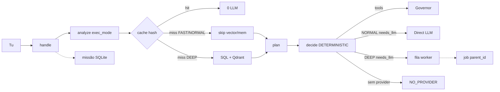

# GOD — roadmap (2026-09-04)

Fonte: código em `/home/user/super-ai`.  
GitHub: [rpolicarpo100/GOD](https://github.com/rpolicarpo100/GOD) `main`.  
Plane: slug `godsx` MEASURED — **não** é o núcleo.

Este é o roadmap **correcto**. Não é marketing. Fluxo = código actual.

**HEAD de código P1:** [`3c0c8cb`](https://github.com/rpolicarpo100/GOD/commit/3c0c8cb) · testes **89 OK**.

## Prioridade

| Pri | Sistema | Objectivo | Estado | Evidência |
| --- | --- | --- | --- | --- |
| 🔴 P0 | Fast Path | eliminar latência desnecessária | **FEITO** | `brain.exec_mode=FAST` → sem Qdrant/SQL. math/git/fs/parse/status |
| 🔴 P0 | Latency telemetry | descobrir onde realmente demora | **FEITO** | `runtime._mark` → `latency_ms` + `stages_ms` MEASURED |
| 🔴 P0 | Direct LLM path | não pôr chat simples sempre na queue | **FEITO** | `executive.decide` NORMAL/FAST → inline. DEEP → fila |
| 🔴 P0 | Smart memory | memória apenas quando necessária | **FEITO** | `need_mem` só DEEP ou complexity≥5 |
| 🟠 P1 | Executive Core | verdadeira decisão/orquestração | **FEITO** | `superai/executive.py` `decide()`. Sem classe Brain. `handle` mantém-se |
| 🟠 P1 | Mission Engine | objectivos persistentes | **FEITO** | `superai/mission.py` SQLite. `/api/missions`. chat `missão:` / actual / conclui |
| 🟠 P1 | Task Graph | dependências + paralelismo | PARTIAL | `queue.parent_id` + `job_is_ready`. `/api/graph`. inflight=1. Sem DAG. Sem paralelo |
| 🟠 P1 | Model Router | qualidade/latência/custo | PARTIAL | `routing.sort_adapters` n≥3 MEASURED. PREMIUM→claude se probed. cost UNKNOWN |
| 🟡 P2 | Agent Factory | agentes especializados | **NOT IMPLEMENTED** | Builder (`gods.py`) ≠ factory |
| 🟡 P2 | Validator | verificar trabalho | PARTIAL | `brain.evaluate()` heurístico, não testes da tarefa |
| 🟡 P2 | Third Eye 2.0 | criticar decisões | PARTIAL | `observer` métricas host. Sem crítica de planos |
| 🟢 P3 | GOD Factory | criar GODs especializadas | **NOT IMPLEMENTED** | perfis no mesmo handle |
| 🟢 P3 | Compute Mesh | PC + portátil + telemóvel | **NOT IMPLEMENTED** | `pc_node` USER_DECLARED only |
| 🟢 P4 | UI Command Center | visualizar toda a operação | PARTIAL | dashboard: missão + graph + `decision.path` · chips P0–P4 |

## Feito

- P0 completo (Fast Path, latency MEASURED, Direct LLM, smart memory).
- P1 Executive + Mission no código, APIs e dashboard.
- GitHub público + push por deploy key SSH (`3c0c8cb` e seguintes).
- Plane `godsx` / GODSX work-items MEASURED (`in_product=false`).
- Caps PC i5-4590 50%. 22€ IVA USER_STATED ≠ API UNKNOWN.

## A fazer (ordem)

1. **P2 Validator** — provas da tarefa, não só `evaluate()` heurístico. Sem agente QA fictício.
2. **P2 Third Eye 2.0** — criticar decisões/planos com factos MEASURED. Sem LLM de crítica inventado.
3. **P1 graph** — fica PARTIAL de propósito: inflight=1 neste host; paralelo só no PC com cap de cores, nunca 4/4.
4. **P1 router €** — só com `source` verificada em `model_pricing`. Até lá cost=UNKNOWN.
5. **P4 UI** — mission/graph/decision já visíveis; falta command center de missão/grafo interactivo.
6. **Não** P2 Agent Factory, P3 GOD Factory, P3 mesh, Desktop, swarm, Redis/K8s por aparência.

## GitHub deploy

- Repo: https://github.com/rpolicarpo100/GOD
- Branch: `main`
- Push: SSH deploy key (nunca HTTPS PAT, nunca commitar `.env` / chave privada)
- P1: `3c0c8cb` · testes 89 OK

## Não agora

Desktop, swarm, marketplace, Redis/Postgres/Kafka por aparência, segundo `handle`, preços inventados, Plane como núcleo, classe ExecutiveBrain, motor DAG, Agent Factory.
