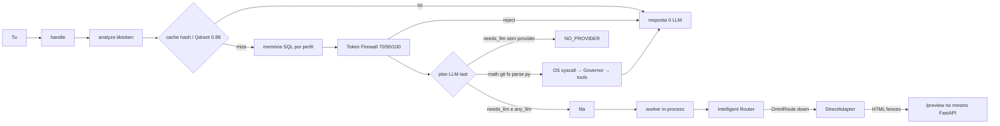

# GOD — roadmap e fluxo (2026-09-04)

Ela chama-se **GOD**. Fonte: código em `/home/user/super-ai` + sondas neste host. Sem marketing.

**GitHub:** [rpolicarpo100/GOD](https://github.com/rpolicarpo100/GOD) — `origin/main` em `bb9ffec`. Local **à frente** (`7b8902f`+). Push desta sessão: SSH **Permission denied**.  
**Plane:** `users/me` 200. Workspace `GODSX` **404 MEASURED**. Sem board. Sem issues.  
**LLM:** Ollama :11434 fechado · OmniRoute :20128 fechado · APIs probed. Modo **TOKEN_SAVER**.  
**GPU:** ausente, `required=false`.

## Fases — estado MEASURED

| Fase | Quê | Estado | Evidência |
|---|---|---|---|
| F0 | Infra FastAPI SQLite tools Governor | **FEITO** | `server.py` `:8000` |
| F1 | LLM-last cache→mem→tools→router | **FEITO** | `runtime.handle` |
| F2 | Memória Qdrant hashing 384 | **FEITO** | neural **não** |
| F3 | Fila + worker in-process | **FEITO** | GPU não exigida |
| F4 | Token Intelligence | **FEITO** | cost **UNKNOWN**; avisos 70/90/100 **tokens** |
| F5 | OS kernel | **FEITO** | sem preempção running |
| F6 | LLM vivo | **FEITO** | diálogo curto no prompt |
| F7 | GitHub público | **PARCIAL** | repo existe; local ahead; push SSH falhou nesta sessão |
| F8 | Plane no produto | **NÃO** | sem workspace_slug |
| F9 | Embeddings neurais / SearXNG / Postgres | **NÃO** | ausentes |
| F10 | Preço € / Langfuse | **NÃO** | sem source |
| F11 | Sites locais `/preview` | **FEITO** | `data/projects` + Governor write |
| F12 | GOD Builder (perfis, 1 handle) | **FEITO** | `superai/gods.py` |
| F13 | Repair MEASURED + memória por perfil + rollback | **FEITO** | `superai/repair.py` · `kinds=` · `history/` |
| F14 | Isolamento cache/Qdrant por `god_id` | **FEITO** | post-filter payload |
| F15 | Custo 3 baldes + PC i5-4590 caps 50% | **FEITO** | 22€ IVA incluído USER_STATED ≠ API UNKNOWN. layout `applied_here=false` |
| F16 | GOD 2.0 audit + FAST path | **FEITO** | `GOD20.md`. FAST skip vector/mem. Plane probe MEASURED. AUTONOMOUS/DAG **não**. Disco 2TB USER_DECLARED |

## Não adicionar agora

- Desktop Windows, wizard, swarm, marketplace, SDK, workflow visual.
- Plane no dashboard sem issues da API.
- Preços hard-coded. cost continua UNKNOWN.
- Segundo `handle` / Repair GOD como agente.

## A fazer (quando houver evidência)

1. Push GitHub (PAT no `.env` gitignored; nunca no git).
2. Plane só com `PLANE_API_KEY` + `workspace_slug` + issues da API. `GODSX` é USER_DECLARED — **não** há adapter.
3. Preços API só com `source` verificável. 22€ IVA incluído ≠ tokens.
4. Este sandbox ≠ PC i5-4590. Caps 12GB / 2 cores / GPU não-LLM aplicam-se **quando** ela correr aí.
