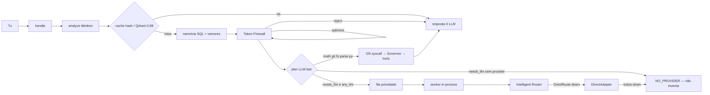
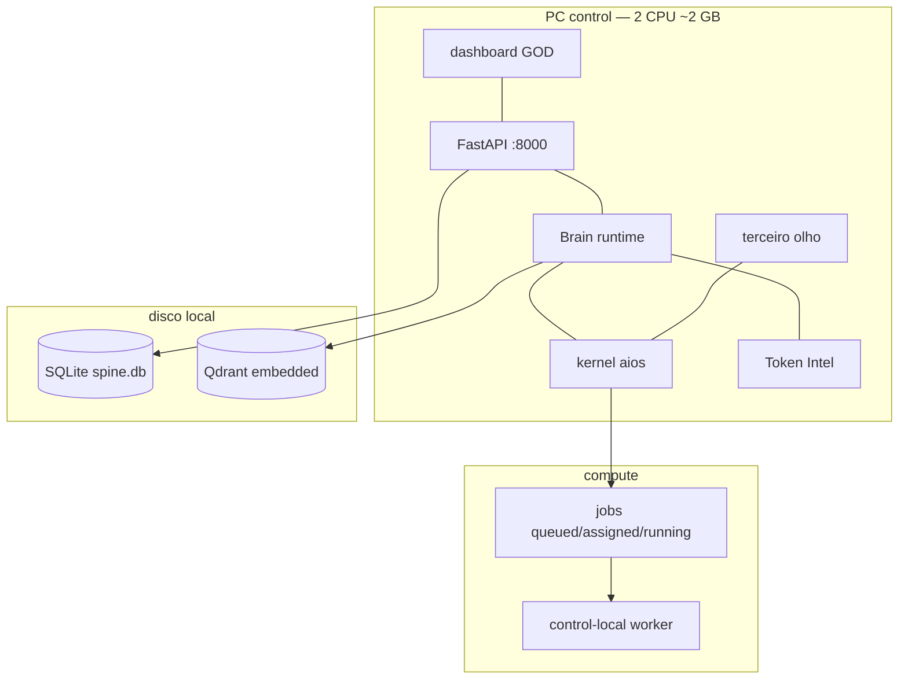

# GOD — roadmap e fluxo (2026-09-04)

Ela chama-se **GOD**. Fonte: código em `/home/user/super-ai` + sondas neste host. Sem marketing.

**GitHub:** [rpolicarpo100/GOD](https://github.com/rpolicarpo100/GOD) — **publicado** `origin/main`.  
**Plane:** API `users/me` 200 (conta Ruben Policarpo). **Não há adapter no produto.** Workspaces não listados. Sem issues criadas daqui.  
**LLM:** Ollama :11434 fechado · OmniRoute :20128 fechado · APIs probed (Groq/Cerebras/Gemini/OpenRouter/inference/Z.ai/Claude). Chat filtra whisper/guard. Modo **TOKEN_SAVER**.  
**GPU:** ausente, `required=false`.

## Fases — estado MEASURED

| Fase | Quê | Estado | Evidência |
|---|---|---|---|
| F0 | Infra FastAPI SQLite tools Governor | **FEITO** | `server.py` live `:8000` |
| F1 | LLM-last cache→mem→tools→router | **FEITO** | `runtime.handle` |
| F2 | Memória Qdrant embedded hashing 384 | **FEITO** | neural **não** — HashingVectorizer |
| F3 | Fila + worker in-process | **FEITO** | GPU não exigida |
| F4 | Token Intelligence | **FEITO** | cost **UNKNOWN**; 9240 actual = poluição de testes, não Claude |
| F5 | OS kernel admit/syscall/kill/ps | **FEITO** | sem preempção running |
| F6 | LLM vivo | **FEITO** | skip gpt-oss/guard; empty content = fail-over; fala o texto |
| F7 | Deploy GitHub público | **FEITO** | `git push` origin/main https://github.com/rpolicarpo100/GOD |
| F8 | Plane no produto | **NÃO** | chave existe fora do git; código sem adapter |
| F9 | Embeddings neurais / SearXNG / Postgres | **NÃO** | ausentes |
| F10 | Preço € / Langfuse | **NÃO** | sem source |

## Terceiro olho — o que NÃO adicionar agora

- **Não** mais camadas (não duplicar Brain/Router/Governor/Firewall).
- **Não** prompts de “pesquisa” que finjam resultados. Sem SearXNG/LLM = recusar.
- **Não** preços hard-coded. cost continua UNKNOWN.
- **Não** Plane no dashboard até haver `workspace_slug` + issues **criadas pela API** (senão é teatro).
- **Não** voltar a meter PAT/`plane_api_*` no repo. Deploy key já chega para push.
- **Não** tratar `QUALITY_DROP` como falha da GOD: é rating de tarefas `blocked` sem LLM.
- **Próximo código que vale:** (1) UX/personalidade em cima do LLM vivo; (2) Plane só com workspace_slug real; (3) preços só com source. Sem `.env` no git.

## Handoff (próximo trabalhador)

- **Feito:** F0–F7. Chat-model filter. `_format_result` lidera com texto do LLM.
- **A fazer:** F8 Plane só depois de workspace; cost UNKNOWN.
- **Deploy GitHub:** **SIM** `origin/main` https://github.com/rpolicarpo100/GOD
- **Não reescrever** Brain / Router / Governor / Memory / Evolution.
