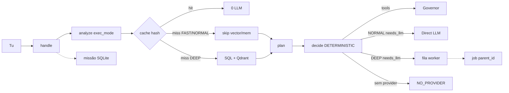

# GOD — roadmap (2026-09-04)

Fonte: código em `/home/user/super-ai`. GitHub: [rpolicarpo100/GOD](https://github.com/rpolicarpo100/GOD) `main`. Plane: slug `godsx` MEASURED, não é o núcleo.

Este é o roadmap **correcto** (prioridade do utilizador). Não é marketing.

## Prioridade

| Pri | Sistema | Objectivo | Estado | Evidência |
| --- | --- | --- | --- | --- |
| 🔴 P0 | Fast Path | eliminar latência desnecessária | **FEITO** | `exec_mode=FAST` → sem Qdrant/SQL. math/git/fs/parse/status |
| 🔴 P0 | Latency telemetry | descobrir onde realmente demora | **FEITO** | `latency_ms` + `stages_ms` MEASURED no pipeline |
| 🔴 P0 | Direct LLM path | não pôr chat simples sempre na queue | **FEITO** | NORMAL/FAST com LLM → inline. DEEP → fila |
| 🔴 P0 | Smart memory | memória apenas quando necessária | **FEITO** | memória/vector só DEEP ou complexity≥5 |
| 🟠 P1 | Executive Core | verdadeira decisão/orquestração | **FEITO** | `executive.decide()` DETERMINISTIC. Sem classe Brain. `handle` mantém-se |
| 🟠 P1 | Mission Engine | objectivos persistentes | **FEITO** | SQLite `missions`. chat `missão:` / actual / conclui. Uma active |
| 🟠 P1 | Task Graph | dependências + paralelismo | PARTIAL | `jobs.parent_id`. claim espera o pai. inflight=1. Sem DAG. Sem paralelo |
| 🟠 P1 | Model Router | qualidade/latência/custo | PARTIAL | stats MEASURED n≥3 reordenam. PREMIUM→claude se probed. cost UNKNOWN |
| 🟡 P2 | Agent Factory | agentes especializados | **NOT IMPLEMENTED** | Builder ≠ factory |
| 🟡 P2 | Validator | verificar trabalho | PARTIAL | `evaluate()` heurístico, não testes da tarefa |
| 🟡 P2 | Third Eye 2.0 | criticar decisões | PARTIAL | observer métricas host. Sem crítica de planos |
| 🟢 P3 | GOD Factory | criar GODs especializadas | **NOT IMPLEMENTED** | perfis no mesmo handle |
| 🟢 P3 | Compute Mesh | PC + portátil + telemóvel | **NOT IMPLEMENTED** | `pc_node` USER_DECLARED only |
| 🟢 P4 | UI Command Center | visualizar toda a operação | PARTIAL | dashboard: missão + graph edges + decision.path |

## Não agora

Desktop, swarm, marketplace, Redis/Postgres/Kafka por aparência, segundo `handle`, preços inventados, Plane como núcleo, classe ExecutiveBrain, motor DAG.

## Feito à volta (não é P0–P4)

GitHub público + deploy key SSH. Plane `godsx` / GODSX work-items MEASURED. Caps PC i5-4590 50%. 22€ IVA ≠ API UNKNOWN.
